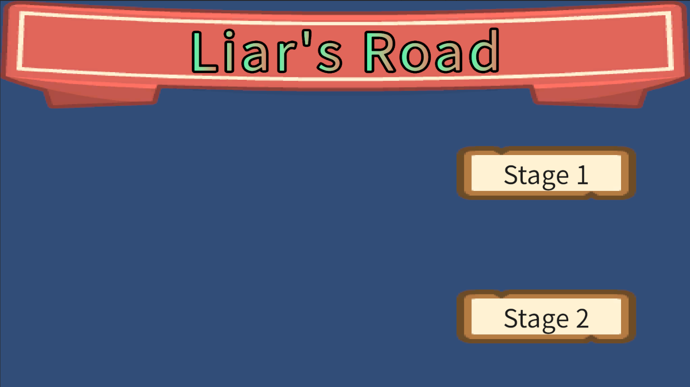
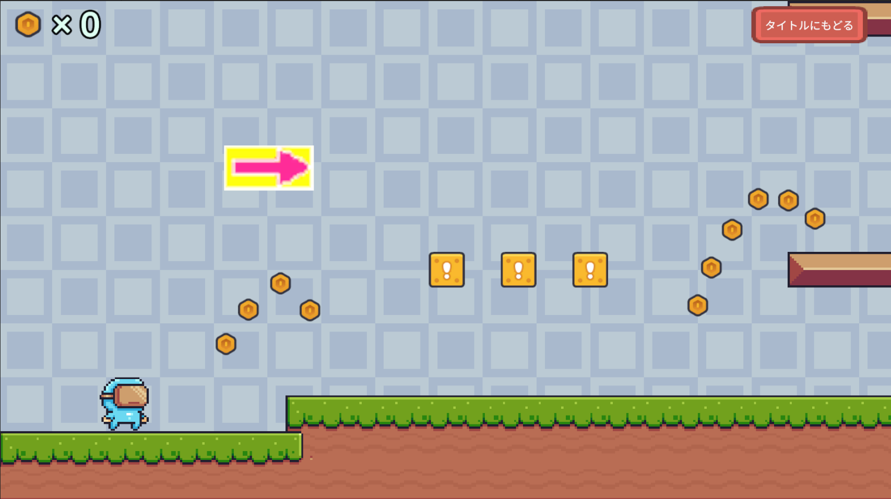
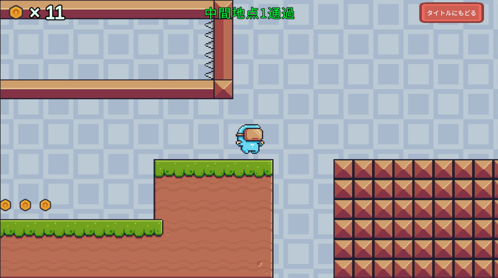

# ライアーズロード(リメイク)

Unity/C#で制作した2Dアクションゲームです。

## 関連リンク

[オリジナル版(C++/DXライブラリ)](https://github.com/seitaro-tsuji/LiarsRoad-Portfolio)

## プレイ動画

https://youtu.be/Q0NbtuXjiMI

## スクリーンショット

### タイトル画面

### ステージ画面

### リザルト画面
.png)

※その他のスクリーンショットは`Screenshots`フォルダに掲載しています。

## 実行方法

1. `Build`フォルダから`LiarsRoadRemake.zip`をダウンロードします。
2. zipファイルを展開します。
3. `LiarsRoad-Remake.exe`を実行してください。

## 使用技術

* Unity
* C#
* Visual Studio

## 制作形態

個人制作

## ゲーム概要

初見殺しのギミックをテーマにした2Dアクションゲームです。

C++/DXライブラリで制作した自作ゲームをUnity/C#でリメイクしました。
オリジナルステージの再現に加えて、不具合の修正やBGMの追加などの改善を行い、完成度の向上を図りました。

## 操作方法

【キーボード・マウス】
- A,Dキー：左右移動
- Wキー：ジャンプ
- 左クリック：ボタンを押す

## 工夫した点

### 開発・設計面の工夫

オリジナル版は機能追加や不具合修正を重ねる中で保守性に課題が生じ、開発の継続が難しくなっていました。

そこでUnityを用いて一から再設計し、オリジナル版のゲーム性を意識しながら、設計や保守性の改善を目的としてリメイクを行いました。

具体的には、以下の点を改善しました。

- `Player`クラスに機能を集約するのではなく、`PlayerController`や`PlayerStatus`など役割ごとにクラスを分割し、機能追加や保守をしやすい設計にした
- シングルトンの`AudioManager`や`GameManager`クラスを導入し、音声再生やゲーム進行の管理を一元化した
- 下からしか叩けない隠しブロックを横から叩ける不具合を修正した

### プレイヤー体験を改善するための工夫

オリジナル版のプレイテストで得られたフィードバックをもとに、プレイヤーがストレスを感じやすい箇所を分析し、ゲーム体験の改善を行いました。

具体的な改善点は以下の通りです。

- プレイテストで特に理不尽になりやすいと判断した初見殺しトラップの直前にチェックポイントを追加し、失敗後も素早く再挑戦できるようにした
- BGM・SEを追加し、ゲーム全体の演出を強化した

## 今後実装予定の機能

- セーブ・ロード機能を実装する
- 死亡回数をカウントし、クリア時に表示する
- タイトル画面を豪華にする
- ゲームパッドに対応する
- 新しいトラップを実装した新ステージを追加する

## ソースコード
`Scripts`フォルダに掲載しています。
